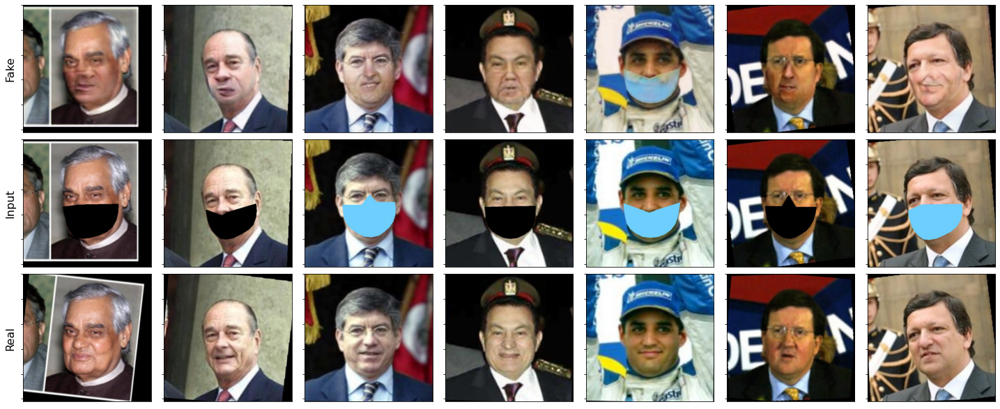
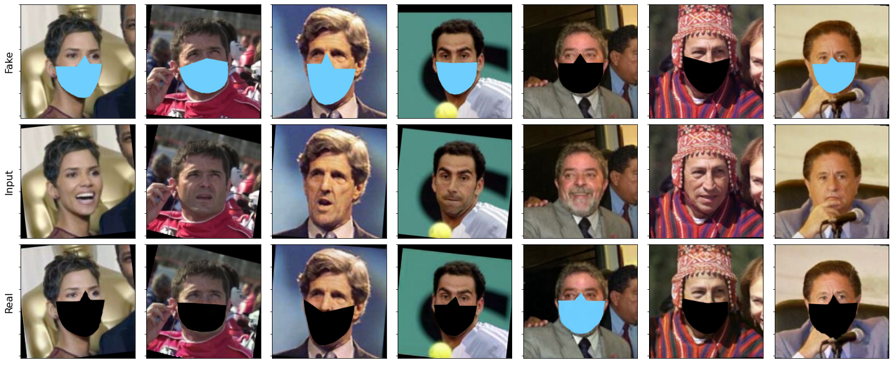

# Add and remove masks to/from people's faces using GANs

### Abstract
&nbsp;&nbsp;&nbsp;&nbsp;&nbsp;&nbsp; Image translation is concerned with taking one visual
representation in a domain, and transforming it into another domain, whilst maintaining similarity to the input in
the original domain. Well known examples to this include,
image colourisation, creating realistic images from edge
contours, taking horse images and converting them to zebras, changing people’s genders and alike.

&nbsp;&nbsp;&nbsp;&nbsp;&nbsp;&nbsp; In this project, we examine a problem relevant to the pandemic, that is, adding masks to people’s faces or removing them, and discuss state-of-the-art technique CycleGAN.
Furthermore, we evaluate the performance of person identitification classifiers with real/fake data with/out masks.
We show that CycleGAN produces well masked faces from
naked faces as input, while provides poor results of naked
faces starting from masked faces. Additionally, we show
improvement of classification accuracy on synthetic data

 

### Download 
Please, download the pretrained models for Task1:Classifers (VGG16, ResNet18), and Cycle-GAN:

>- Link: https://drive.google.com/file/d/1-QQherdCUz3aZibFsVHMOMkc_mngWIIQ/view?usp=sharing 

### Training

Our tasks each in a separate notebook:

>- Task 1: Training classifiers on LFWD dataset to identify people:
>>>- Task1_Classifiers_Transfer_Learning.ipynb

>- Task 2: Training CycleGAN on LFWD dataset:
>>>- Train CycleGAN.ipynb

>- Task 3: Evaluate Classifiers of Task 1 on fake data generated by CycleGAN
>>>- CycleGAN_Evaluation.ipynb

### Team:
    - Imad Eddine MAROUF
    - Umit Bora GOKBAKAN
